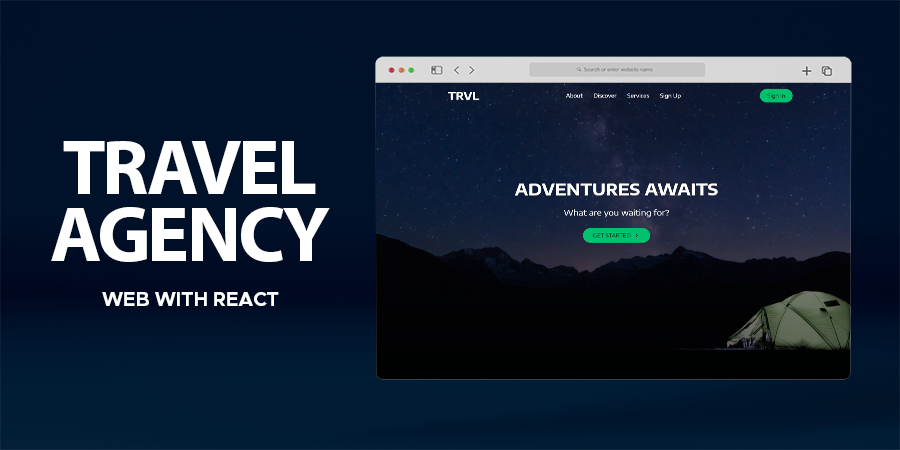
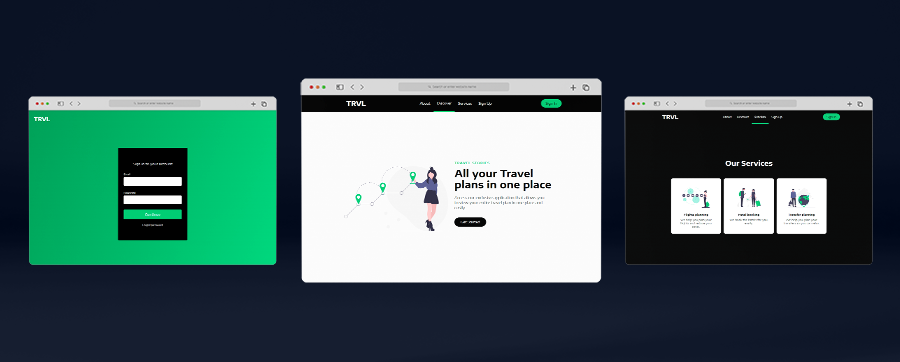

# Travel Agency Web with React

### [Live Demo](https://travel-agency-web-react02-jg.netlify.app/)

## Stack

- React
- Styled Components

## Features

- One-page web with hero, info, and services sections.
- Scroll navigation with react-scroll.
- Mobile ready.
- Sign In page.

___

## Getting Started with Create React App

This project was bootstrapped with [Create React App](https://github.com/facebook/create-react-app).

### Available Scripts

In the project directory, you can run:

#### `npm install`

#### `npm start`